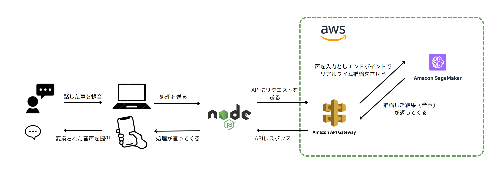

# AI Zunda Web
<p align="center">
  


</p>

## アプリ概要  
- 自分の話した声をずんだもんの声に変換させる
- AIによってリアルタイムで推論をさせる
## 紹介動画
以下のサムネをクリック！  

<a href="https://youtu.be/fFRmw5yqg-A"></a>

## URLとQRコード（デプロイ済み）
https://ai-zunda-web.vercel.app/  


## 利用方法
- 上記リンクにアクセス
- 男性か女性を選択
- 録音ボタンを押して変換したいことを話す  
  
  
- 「録音停止ボタン」を選択
- 「AIでずんだもん」を選択 → しばらく待つ → 変換された音声が返ってくる

## チームメンバー
| Name | GitHub Account |
| ---- | ---- |
| Motoki Nakao| https://github.com/mkt11 |
| Shin Ito | https://github.com/teramaguro |
| Hiroto Tsuchida | https://github.com/Da-Tsuchi | 
| Koshiro Itaya | https://github.com/itaya0320 |

## 使用した技術

<!-- <div class="table2"> -->
| Skill | Language&Framework |
| ---- | ---- |
| Front End | HTML/CSS<br> Javascript<br> - React<br>- Node.js |
| Back End| Python<br> - Pytorch |
| Cloud Service | AWS |

</div>

## 処理の流れ


## 使用した技術の詳細
- ### RVC(Retrieval-based-Voice-Conversion)
  - 自分の声を機械学習させた声に変換してくれるAIモデル
  - https://github.com/RVC-Project/Retrieval-based-Voice-Conversion-WebUI?shem=iosie を参考
  - RVCモデルをずんだもんの音声データによってファインチューニングしたモデルを使用
  - 入力した音声をもとにAIモデルに推論させている
- ### AWS
  リアルタイムでエンドポイント推論するために使用  
  
  - ### Sage Maker
    - 学習したモデルに対してのエンドポイントを作成
  - ### API Gateway
    - アプリケーションのフロントエンドからリクエストを受け取る
- ### React/Node.js
    - AI Zunda Webのサイト部分の実装
- ### デプロイ
  - Webページ：Vercelを使用
  - エンドポイント：AWSのAPIGatewayを使用
- ### GitHub
  - チームでコードを共有するために使用
  - Forkを使用し、各々のリポジトリからプルリクエストを送ることでコーディング


## ローカルでの動作方法(Windows11で確認済み)
- ### React/Node.jsをインストール
    https://nodejs.org/ja/download/ より自分のPCにあったインストーラを選択

- ### リポジトリをクローンしてきて、npm install
    ```
    git clone https://github.com/mkt11/AI_zunda_web.git
    npm install
    ```

## 参考・引用リンク
