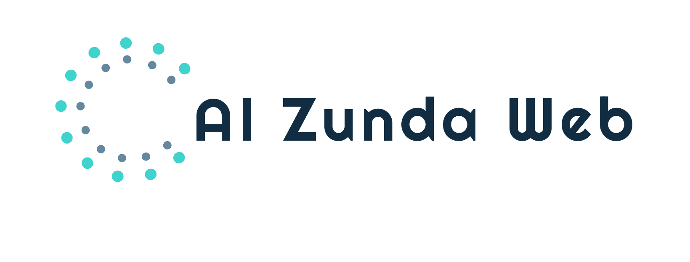
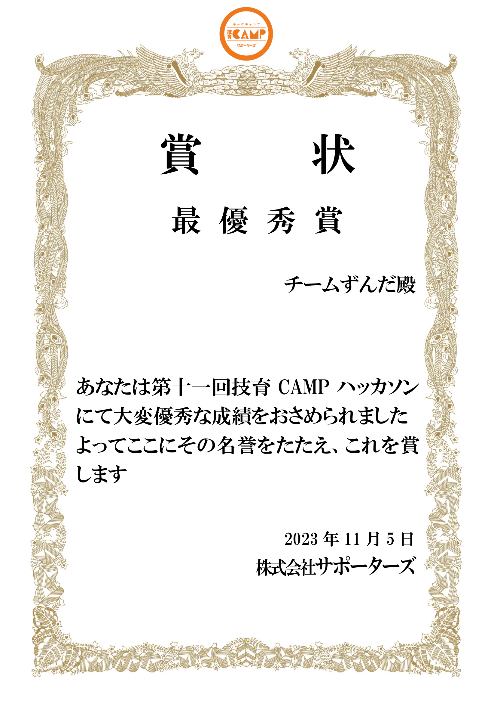
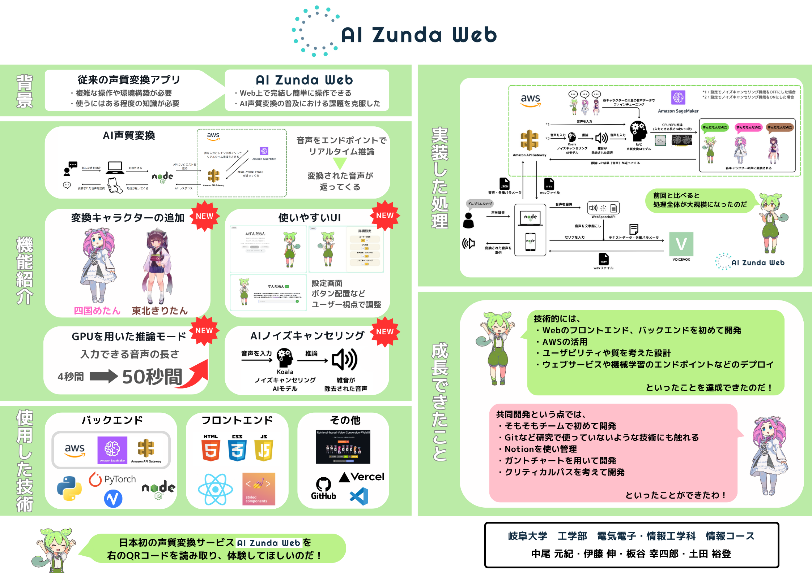
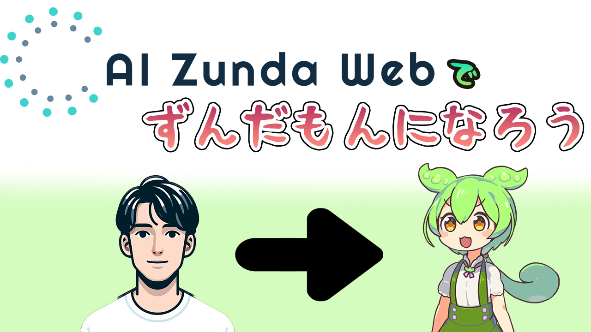
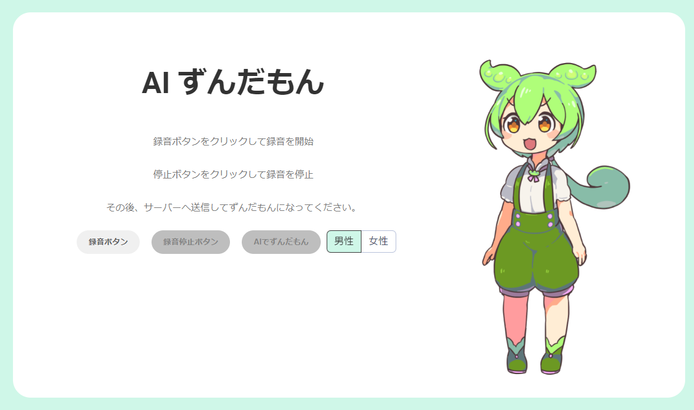
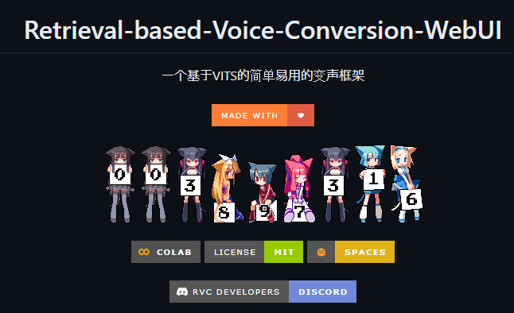

# AI Zunda Web
<p align="center">
  


</p>

## NEWS
- 技育アドバンスに出場！　　
  - 
  - 技育CAMPのマンスリーハッカソンやキャラバンで入賞したチームのみが参加できる
- <a href="https://www.gifu-u.ac.jp/news/news/2023/11/entry20-12819.html" target="_blank"> 岐阜大学ホームページ</a>で、最優秀賞を受賞したことが紹介されました！
  - 

- 技育CAMPマンスリーハッカソン vol.11にて最優秀賞を受賞！
  - 
  
## アプリ概要  



## 紹介動画
以下のサムネをクリック！  

<a href="https://youtu.be/-wveWR9qSKw"></a>

## URLとQRコード（デプロイ済み）
https://ai-zunda-web.vercel.app/  


## 利用方法
- 上記リンクにアクセス
- 「録音ボタン」をクリックして話す  
  
  
- 「録音停止ボタン」をクリック
- 「AIでずんだもん」をクリック→ 少し待つ → 変換された音声が返ってくる

## チームメンバー
| Name | GitHub Account |
| ---- | ---- |
| Motoki Nakao| https://github.com/mkt11 |
| Shin Ito | https://github.com/teramaguro |
| Hiroto Tsuchida | https://github.com/Da-Tsuchi | 
| Koshiro Itaya | https://github.com/itaya0320 |

## 使用した技術

<!-- <div class="table2"> -->
| Skill | Language & Framework |
| :----: | :----: |
| Front End | HTML/CSS<br> Javascript<br> - React<br>- Node.js |
| Back End| Python<br> - PyTorch |
|AI Model| RVC |
| Cloud Service | AWS |
| Others| Git/GitHub<br>VSCode |
</div>

## 処理の流れ


## 使用した技術の詳細
- ### RVC(Retrieval-based-Voice-Conversion)
  <a href="https://github.com/RVC-Project/Retrieval-based-Voice-Conversion-WebUI"></a>

  - 自分の声を特定の話者が発話したような声質の発話音声に変換するAIモデル
  - 入力した音声をもとにAIモデルに推論させている
  - ずんだもんの音声データによって、RVCをファインチューニングしたモデルの重みを使用
    - 参考：https://zunko.jp/multimodal_dev/login.php

- ### Koala
    <a href="https://github.com/RVC-Project/Retrieval-based-Voice-Conversion-WebUI"></a>

  - ノイズキャンセリングをするためのSDK
  - AI Zunda WebではAWS上で動作させている

- ### AWS
  リアルタイムでエンドポイント推論するために使用  
  
  - ### Sage Maker
    - 学習したモデル（ずんだもんの音声データでファインチューニングしたRVCモデル）に対してのエンドポイントを作成
  - ### API Gateway
    - アプリケーションのフロントエンドからリクエストを受け取る
- ### React/Node.js
    - AI Zunda WebのサイトのUI部分の実装
    - 画面サイズによってレイアウト崩れが起きないように作成
- ### デプロイ
  - Webページ：Vercelを使用
  - エンドポイント：AWSのAPIGatewayを使用
- ### GitHub
  - チームでコードを共有するために使用
  - Forkを使用し、各々のリポジトリからプルリクエストを送ることでコーディング


## ローカルでの動作方法(Windows11で確認済み)
- ### React/Node.jsをインストール
    https://nodejs.org/ja/download/ より自分のPCにあったインストーラを選択

- ### リポジトリをクローン・npm install
    ```
    git clone https://github.com/mkt11/AI_Zunda_web_release.git
    npm install
    npm start
    ```
- ### AWSの設定
  - 省略

